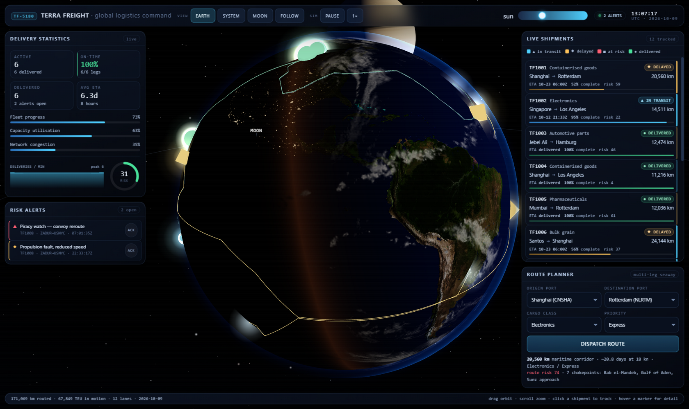
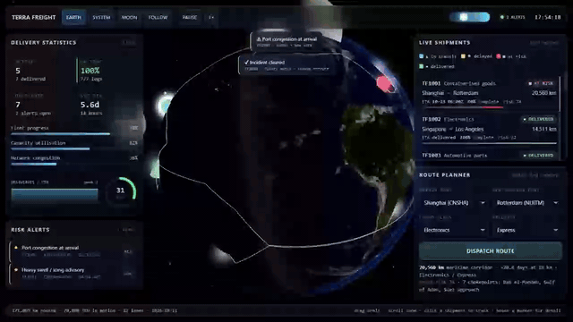
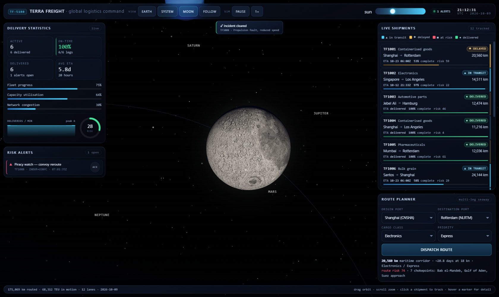
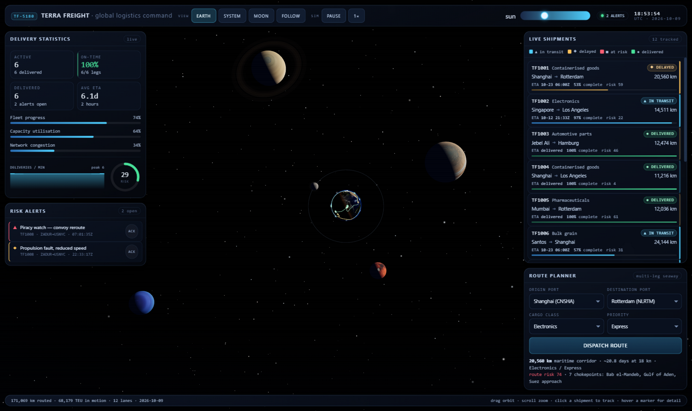
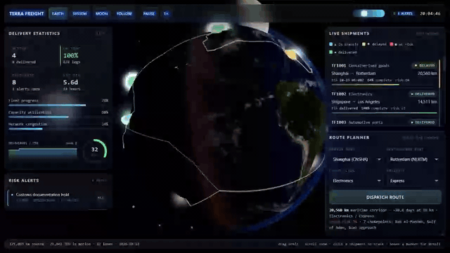
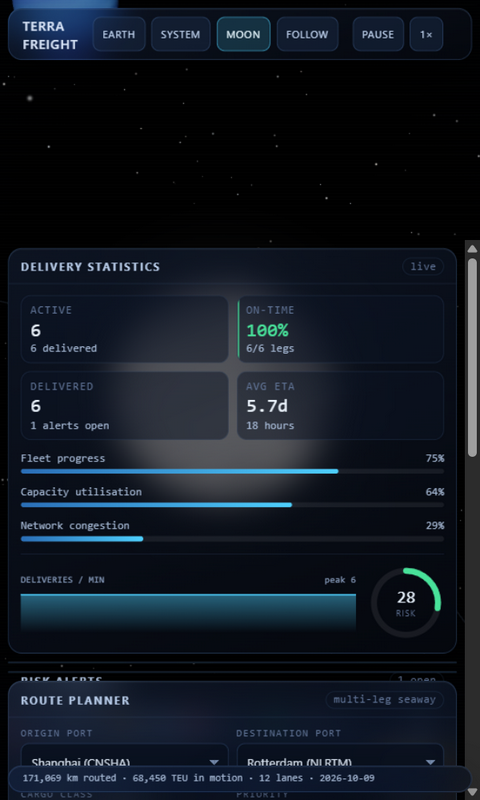

# TERRA FREIGHT — 3D freight-tracking dashboard

A single-file [Three.js](https://threejs.org) command dashboard for global ocean
freight. A realistic 3D Earth sits at the centre of a starry system, wrapped in
frosted-glass panels that track live shipments, plan new routes, report delivery
statistics and raise risk alerts.

Everything that makes the app work — markup, styles, the 3D scene, the
simulation and the UI wiring — lives in one file: [`index.html`](index.html).

```
npm install
npm run dev        # → http://localhost:5180
```



The sun is a single directional light and its azimuth is a live slider — drag
it and the terminator sweeps across the planet:



---

## Contents

- [What it does](#what-it-does)
- [The scene](#the-scene)
- [The freight model](#the-freight-model)
- [Why the lanes are not great circles](#why-the-lanes-are-not-great-circles)
- [The dashboard](#the-dashboard)
- [Controls](#controls)
- [Getting started](#getting-started)
- [Project layout](#project-layout)
- [Verification](#verification)
- [Performance notes](#performance-notes)
- [Credits and licences](#credits-and-licences)
- [Known limitations](#known-limitations)

---

## What it does

The dashboard models an ocean freight network in real time:

- **12 live shipments** across 12 major ports, each on its own multi-leg
  maritime corridor, each advancing toward its destination.
- **Per-leg risk** computed from the chokepoints and hazard basins a corridor
  actually passes through, scaled by cargo class and priority.
- **Incidents** that fire against in-flight shipments — typhoons, piracy
  advisories, propulsion faults, port congestion, customs holds — slowing the
  vessel, raising risk and raising an alert.
- **Delivery accounting**: completed legs, on-time percentage, session totals
  (km routed, TEU in motion).
- **A route planner** that previews any port pair as a real maritime corridor
  with distance, transit time, risk score and the chokepoints it crosses.

## The scene

One `DirectionalLight` — the sun — lights every body in the scene. There is no
ambient fill light: night sides are dark because the sun is the only source.
Its azimuth is adjustable at runtime, which moves the terminator across the
globe live.

**Earth** (radius 10) is a custom `ShaderMaterial`:

| Layer | Implementation |
|---|---|
| Surface | 4K day map, lit with a wrapped lambert term |
| Night | 4K night map driving warm city-light emission, faded out by the day mix |
| Terminator | `smoothstep(-0.14, 0.24, dot(normal, sunDir))` with a narrow warm scattering band at the terminator |
| Relief | 2K normal map, sampled in a stable tangent frame (`cross(up, normal)`) so the perturbation stays noise-free |
| Ocean | 2K specular map as an ocean mask; Blinn-Phong glint on the *geometric* normal, exponent 380, gain 0.28 |
| Clouds | Separate sphere at 1.012 R, drifting independently, lit by the same sun |
| Atmosphere | Back-side rim shell at 1.045 R (`pow(1 - |N·V|, 4.4)`, brighter on the sun side) |
| Halo | Camera-facing plane with an analytic `exp` limb, gated to the region *outside* the silhouette so it never washes the globe |

**Moon** (0.273 R at 2.6 R) is tidally locked on a 5.14°-inclined orbit, with
its orbital angle driven by the simulation clock at the real 27.32-day period.



**Jupiter, Saturn, Mars and Neptune** sit on a stylised orrery ring around
Earth, each with its own axial tilt and spin rate. Saturn carries an
alpha-textured ring whose UVs are remapped radially (r → u, side → v); Jupiter
and Neptune get a faint rim-glow shell.

**Background**: 9,750 twinkling points in three layers, the largest biased into
a galactic band, drawn with a custom additive point shader.

## The freight model

| Model | Values |
|---|---|
| Ports | Shanghai, Singapore, Rotterdam, Los Angeles, Jebel Ali, Santos, Busan, Hamburg, New York, Mumbai, Durban, Sydney |
| Cargo classes | Containerised goods, Electronics, Automotive parts, Pharmaceuticals, Bulk grain, LNG/cryogenic, Heavy machinery — each with a risk and speed multiplier |
| Priorities | Standard, Express, Critical — speed and risk multipliers |
| Chokepoints | Bab el-Mandeb, Gulf of Aden, Strait of Hormuz, Suez approach, Red Sea, South China Sea, Malacca Strait, Panama Canal, Cape of Good Hope, North Atlantic, Bay of Bengal, Luzon Strait |
| Incidents | Typhoon intercept, port congestion, piracy convoy reroute, propulsion fault, customs hold, heavy swell |

Transit time follows from great-circle distance along the corridor at an
18-knot average, scaled by the cargo and priority multipliers; the simulation
clock advances 4 simulated hours per real second.

Risk is the sum, over every chokepoint, of `weight × (1 − closestApproach /
outerRadius)`, measured as the **closest approach of the corridor to that
chokepoint** rather than a count of samples inside it — so a corridor that
merely clips the edge of a basin is not scored the same as one that runs
through its centre.

## Why the lanes are not great circles

A great circle from Shanghai to Rotterdam crosses central Asia. Real freight
does not, so lanes are routed through a **maritime corridor graph**: 12 ports
and 83 waypoints joined by 111 short open-water edges — Malacca, Suez, the
Panama Canal, the Cape route, Gibraltar, Bass Strait and so on.

The graph is authored alongside an offline validator,
[`tools/seaway_check.py`](tools/seaway_check.py), which samples every edge
against the ocean mask in `public/textures/earth_specular.jpg` and **fails if
any corridor crosses more than 90 km of terrain** (canal and strait transits that
legitimately touch land are listed in its `ALLOW` set):

```
$ python3 tools/seaway_check.py
111 edges · 0 crossing > 90 km of land
```

Route lengths land on published real-world figures:

| Corridor | Modelled | Real-world |
|---|---|---|
| Shanghai → Rotterdam | 20,560 km | ~19,500–20,500 km |
| Singapore → Los Angeles | 14,511 km | ~14,000–15,000 km |
| Jebel Ali → Hamburg | 12,474 km | ~12,000 km |
| Shanghai → Sydney | 12,192 km | ~11,900 km |
| New York → Rotterdam | 6,315 km | ~6,200 km |

**If you change a port or waypoint, re-run the validator** — and keep the graph
embedded in `index.html` identical to the copy in the script.

## The dashboard



| Panel | Contents |
|---|---|
| **Delivery Statistics** | Active / on-time / delivered / average ETA KPIs, fleet progress, capacity utilisation, network congestion, a deliveries-per-minute sparkline and a risk gauge |
| **Risk Alerts** | Open incidents with severity, affected shipment and timestamp; each can be acknowledged |
| **Live Shipments** | Per-leg rows: lane, cargo, status, remaining distance, ETA, percent complete, risk. Click a row to select and focus that vessel |
| **Route Planner** | Origin/destination/cargo/priority selectors with a live corridor preview drawn on the globe, plus distance, transit time, risk and chokepoint list |

Status is encoded by **shape as well as colour** — the vessel marker is a cone
in transit, an octahedron when delayed, a cube at risk and a sphere once
delivered, matching the ▲ ◆ ■ ● glyphs in the rows and the inline key above the
list. Colour alone would not survive deuteranopia; shape does.

The top bar carries the brand, camera presets, simulation controls, the sun
azimuth slider and a UTC clock. It is locked to a single row: rather than
wrapping, it sheds non-essential chrome at 1560, 1460, 1360, 1280, 1200 and
1120 px.

## Controls

| Input | Action |
|---|---|
| Drag | Orbit |
| Scroll | Zoom |
| `1` `2` `3` `4` | Earth / System / Moon / Follow presets |
| `Space` | Pause or resume the simulation |
| Sun slider | Rotate the sun, moving the terminator |
| Pause / 1× / 2× / 4× | Simulation speed |
| Click a row, alert or vessel | Select and fly to that shipment |

The four camera presets fly the camera on eased tweens — Earth, the full
system, the Moon, and a follow-cam locked to a vessel:



## Getting started

Requires **Node 18+** (Vite 5). Python 3 with Pillow is needed only for the
corridor validator, not to run the app.

```bash
npm install
npm run dev       # dev server  → http://localhost:5180
npm run build     # production bundle → dist/
npm run preview   # serve the build → http://localhost:5181
```

### Cloning on Windows

The repo is portable — no absolute paths, no symlinks, no native modules — but
two Windows specifics are worth knowing.

```powershell
git clone https://github.com/garvit-pandia/threejs1.git
cd threejs1
npm install
npm run dev
```

1. **Long paths.** `node_modules` nests deeply and Windows still caps paths at
   260 characters by default. Enable long paths once, before installing:

   ```powershell
   git config --global core.longpaths true
   ```

   and, in an **admin** PowerShell (or via Group Policy):

   ```powershell
   New-ItemProperty -Path "HKLM:\SYSTEM\CurrentControlSet\Control\FileSystem" `
     -Name LongPathsEnabled -Value 1 -PropertyType DWORD -Force
   ```

   If `npm install` fails with `ENAMETOOLONG` or `EPERM`, this is the cause.
   Cloning somewhere short like `C:\dev\threejs1` also helps.

2. **Line endings.** `.gitattributes` pins `text=auto eol=lf`, so a checkout
   will not show every file as modified. Leave `core.autocrlf` at its default;
   do **not** set it to `input` here.

Two behavioural differences from the Linux dev setup:

- `server.watch.usePolling` is enabled in `vite.config.js`. It is required under
  WSL2 to avoid serving stale modules; on native Windows it is harmless but
  spends CPU polling. Clear the flag or set it to `false` if you prefer native
  file watching.
- Verification on this workspace uses a headless Chromium; on your machine just
  open <http://localhost:5180> and drive the dashboard by hand (the four camera
  presets, the sun slider, a planner dispatch).

Ports **5180** (dev) and **5181** (preview) are pinned with `strictPort: true`
so a collision fails fast instead of silently shifting to another port.

The app is fully offline after checkout: all textures ship in
`public/textures/` (~3.4 MB) and nothing is fetched from a CDN at runtime. If a
texture is missing the loader records it in `window.__app.errors` and
substitutes a procedural placeholder.

### Ports

This project is part of a shared workspace and follows its port protocol:
**5180** is pinned in `vite.config.js` with `strictPort: true` (dev) and **5181**
is pinned for preview. `server.watch.usePolling` is enabled because native file
watching serves stale modules under WSL2.

## Project layout

```
index.html                  the entire application (markup, CSS, scene, UI, simulation)
vite.config.js              pinned ports, polling watcher
public/textures/            11 equirectangular maps (day, night, clouds, normal,
                            specular, moon, Jupiter, Saturn + ring, Mars, Neptune)
tools/seaway_check.py       offline validator for the maritime corridor graph
docs/screenshots/           renders and demo GIFs used in this README
AGENTS.md                   working rules and invariants for this repo
CHANGELOG.md                the critique-and-improve loop, round by round
```

## Verification

There is no unit-test suite; this is a visual, continuously simulated app, so
verification is done by driving it:

1. **Run the app** and confirm `window.__app.ready === true` with
   `window.__app.errors` empty.
2. **Exercise the surface** — dispatch a route from the planner, click a
   shipment row, acknowledge an alert, cycle the camera presets, move the sun
   slider, pause and change speed.
3. **Check the invariants**: exactly one light in the scene; lanes still on
   water; distances unchanged.
4. **Validate the corridor graph**: `python3 tools/seaway_check.py`.

`window.__app` exposes the state (`shipments`, `alerts`, `stats`, `errors`) plus
`audit()`, `addShipment()`, `setSunAzimuth()`, `setPaused()`, `cameraPreset()`,
`focus()`, `shipmentSnapshot()` and `cameraInfo()` for scripted checks.

## Performance notes

The scene is lightweight by design: ~38k triangles, 60 geometries, 13 textures
and 14 shader programs, with a pixel ratio capped at 2. Tessellation is
deliberately modest (96×72 for Earth, 64×48 for the smaller spheres) because
the visual difference is imperceptible while the vertex cost is not.

Measured here under llvmpipe (software rasterisation) the frame rate is
**fill-rate bound** — 11 fps at 320×220, 8 fps at 900×560 and 5 fps at
1680×1000, scaling purely with pixel count. On a GPU this budget is trivial.
If you need headroom on software rasterisers, lower
`renderer.setPixelRatio()`, reduce the star counts, or raise
`toneMappingExposure` instead of adding lights.

## Credits and licences

| Asset | Source | Licence |
|---|---|---|
| Earth day/night (4K), clouds, normal, specular, Moon | [three.js](https://github.com/mrdoob/three.js) `examples/textures/planets` | MIT (three.js) |
| Jupiter, Saturn + ring alpha, Mars, Neptune | [solarsystemscope.com](https://www.solarsystemscope.com/textures/) | CC BY 4.0 |

Built with [Three.js](https://threejs.org) (MIT) via [Vite](https://vitejs.dev).

## Known limitations

Recorded honestly rather than hidden — the full history is in
[`CHANGELOG.md`](CHANGELOG.md).



- **This is a simulation, not live data.** All shipments, positions, incidents
  and statistics are generated client-side. Nothing is fetched and there is no
  backend.
- **Planets are stylised.** They are on an artistic orrery ring sized for
  composition; distances, radii and periods are not to scale.
- **No mobile gesture tuning.** At ≤1000 px the panels move into a scrollable
  bottom sheet to keep the globe draggable; pinch-zoom and touch inertia are
  untuned.
- **Accessibility is partial.** Controls meet a 34 px minimum height and text a
  10.5 px floor, and status avoids colour-only encoding — but there are no
  `:focus-visible` rings, no ARIA labelling and no reduced-motion mode yet.
- **`Avg ETA` can read oddly early on** when few legs remain to average.
- **Frame rate under software rasterisation is low** — see above.
